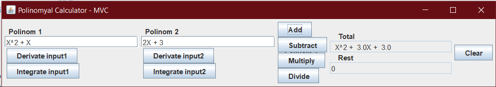

# Polynomial_Calculator

A polynomial calculator with a dedicated graphical interface through which
the user can enter polynomials, select the operation to be performed (i.e. addition, subtraction,
multiplication, division, derivative, integration) and display the result.

1.2 Design considerations
- Object-oriented programming design
- Encapsulation
- The Model View Controller as an architectural pattern for designing the polynomial
calculator.

1.3 Implementation considerations
- Java programming language
- Java Swing for implementing the graphical user interface
- Regex for verifying the validity of the polynomials

1.4 Testing considerations
- JUNIT for testing the application.

